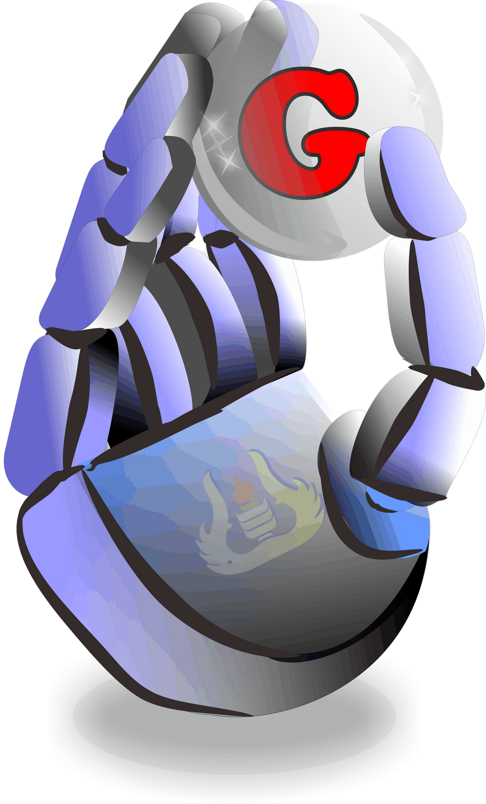

# Unit Kegiatan Robotika UNP - Recruitment Platform
A modern web application for managing the recruitment process at Unit Kegiatan Robotika Universitas Negeri Padang (UNP). Built with cutting-edge technologies to provide a seamless experience for both applicants and administrators.


## Key Features
### For Applicants
- Intuitive multi-step registration form with real-time progress tracking
- Secure document upload system for student cards and required materials
- Real-time application status monitoring
- Mobile-responsive interface for on-the-go access

### For Administrators
- Comprehensive dashboard for application management
- Advanced search and filtering capabilities
- Bulk application processing
- CSV export functionality
- Automated status update notifications

## Technology Stack
### Frontend
- Next.js 15 with React 19
- Tailwind CSS 4 for modern, responsive styling
- TypeScript for enhanced code reliability

### Backend
- Next.js API Routes for serverless architecture
- MongoDB for robust data persistence
- Secure authentication system

### Infrastructure
- Vercel for automated deployment
- CI/CD pipeline integration
- MongoDB Atlas for managed database services

## Getting Started
### System Requirements
- Node.js 18.x or newer
- npm 8.x+ or yarn 1.22.x+
- MongoDB Atlas account
- Vercel account for deployment

### Installation Steps

1. Clone the repository:
   ```bash
   git clone https://github.com/MIkhsanPasaribu/ukrounp-recruitment.git
   cd ukrounp-recruitment
   ```

2. Install dependencies:
   ```bash
   npm install
   # or
   yarn install
   ```

3. Configure environment:
   ```bash
   cp .env.example .env.local
   ```
   Required environment variables:
   ```
   MONGODB_URI=your_mongodb_connection_string
   NEXT_PUBLIC_API_URL=http://localhost:3000/api
   JWT_SECRET=your_secret_key
   ```

4. Start development server:
   ```bash
   npm run dev
   # or
   yarn dev
   ```

5. Access the application:
   ```
   http://localhost:3000
   ```

## Application Structure
- /src/app - Next.js app router pages and API routes
- /src/components - Reusable React components
- /src/lib - Utility functions and database connection
- /src/types - TypeScript type definitions
- /public - Static assets

## Admin Access
The admin panel is accessible at /admin . Default password is admin123 (change this in production).

## Database Structure
The application uses a MongoDB collection called applicants with the following structure:
- _id : MongoDB ObjectId
- email : Applicant's email address
- fullName : Applicant's full name
- status : Application status (Under Review, Shortlisted, Interview, Accepted, Rejected)
- submittedAt : Timestamp of submission
- Various personal and academic information
- Document uploads (encoded as base64 strings)

## Deployment
This application can be easily deployed to Vercel:
1. Push your code to GitHub
2. Connect your repository to Vercel
3. Set up the environment variables in Vercel dashboard
4. Deploy

## Contributing
Contributions are welcome! Please feel free to submit a Pull Request.

## License
This project is licensed under the MIT License - see the LICENSE file for details.

## Contact
For any inquiries, please contact Unit Kegiatan Robotika UNP at mikhsanpasaribu2@gmail.com .
